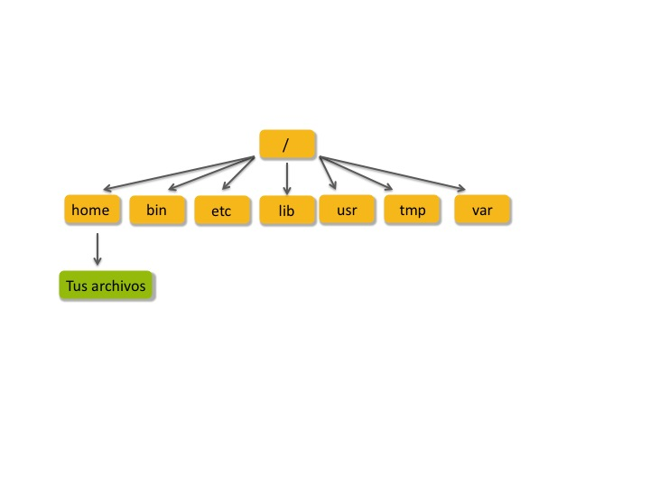

# Día 1: INTRODUCCIÓN A LA LÍNEA DE COMANDOS


## Introducción

UNIX es un sistema operativo desarrollado en los años sesentas y que sigue actualizándose constantemente. Un sistema operativo lo definimos, en esta instancia, como un conjunto de programas que hacen funcionar a la computadora. UNIX es un sistema estable, de múltiples usuarios y “multi-tasking", diseñado tanto para servidores, como para computadoras de escritorio y portátiles. Este sistema operativo tiene una interfaz gráfica (GUI, graphical user interface) similar a la de Microsoft Windows, lo que lo hace más fácil de utilizar. Sin embargo,
existen operaciones que no pueden realizarse a través de la interfaz gráfica, por lo que son necesarios conocimientos de línea de comando de UNIX. No todo se puede solucionar con una ventanita\!  

Existen varias versiones de UNIX, aunque todas comparten las mismas características. Las variedad más popular es GNU/Linux. Linux viene a su vez en varios “flavors", por ejemplo FEDORA, Red Hat, Centos, etc.

## El sistema operativo

El sistema operativo de UNIX consiste en tres partes:  

  - Kernel

  - Terminal

  - Programas

El **kernel** es el corazón del sistema operativo: aloca tiempo y memoria para programas, maneja el sistema de archivos y las comunicaciones en respuestas a llamadas del sistema. La **terminal** actúa como interfaz entre el usuario y el Kernel. Cuando un usuario se “loggea” al sistema, el programa de login chequea el nombre de usuario y la contraseña, y seguidamente arranca un programa llamado terminal. La terminal es un interpretador de líneas de comando (CLI, command line interpreter), es decir, interpreta los comandos que el usuario ingresa y se asegura de comenzar el proceso de ejecucíon. Los **comandos** son en sí mismos programas: cuando terminan la terminal devuelve otro “prompt" , por ejemplo “$".   Un ejemplo que ilustra como la trabaja junto con el Kernel, podría ser cuando el usuario escribe en la terminal `rm myfile` (este comando tiene el efecto de eliminar el archivo "myfile"). La terminal busca en el sistema el archivo que tiene el programa `rm` y seguidamente le pide al Kernel a través de llamadas del sistema que ejecute el programa sobre el archivo `myfile`. Una vez terminado el proceso, la terminal devuelve el prompt `$` al usuario.  

*Tips:  
Si se ingresa parte del nombre de un comando, un archivo o un directorio, presionando la tecla **Tab** la terminal completa el resto del nombre automáticamente. Si la terminal encuentra mas de un comando/archivo/directorio que comienza con la misma parte que tipeó el usuario, la misma muestra todas las posibilidades (algunos tipos de terminal hacen un “beep" debiendo el usuario ingresar más letras). La terminal guarda la lista de comandos que ingresó el usuario, es decir guarda la historia de comandos.*

## La estructura de directorios

Todo en UNIX es un archivo o un proceso. Un proceso es un programa ejecutable identificado por un identificador único (PID, process identifier). Un archivo es una colección de datos, creados por los usuarios utilizando editores de texto, compiladores, etc. Archivos pueden ser documentos de texto, el texto de un programa escrito en algún lenguaje de programación, una carpeta con archivos y otras carpetas, instrucciones legibles sólo por la máquina, etc.   Todos los archivos se agrupan en una estructura de directorios, en uno en más discos (igual que en Windows, en donde existen muchas particiones llamadas A:, B:, C:, etc que pueden ser discos duros, pen drive, CD-ROMs). El sistema de archivos es estructurado de forma jerárquica. La punta de la jerarquía es usualmente lo que se llama “root" y se escribe como “/". La siguiente figura muestra un ejemplo de esta jerarquía.   


## Sistema multiusuario

UNIX es un sistema operativo de ambiente multi-usuarios, en contraste con por ejemplo Windows. Cuando se tiene Windows en una PC todos los archivos son legibles y modificables por el usuario. El usuario puede, por ejemplo, borrar cualquier tipo de archivo y en principio nadie lo impide (quizás algún mensaje de advertencia de Windows). Por el contrario, en UNIX existen varios usuarios en un mismo sistema. Por lo tanto, cada archivo o directorio tiene propietarios asociados. El “home directory" (el directorio donde el usuario guarda sus archivos) es propiedad de ese usuario. Asimismo, todos los archivos que él genera. Cada archivo o carpeta tiene permisos asociados. Por ejemplo, un usuario regular puede ejecutar y leer programas del sistema, pero no puede sobre escribirlos. Un usuario puede cambiar los permisos de cualquier archivo o carpeta de su propiedad, pero no de archivos ajenos. Veremos ejemplos de esto más adelante. Ya que definimos que el sistema es de multi-usuarios tenemos que poder decirle al sistema quienes somos. Además tenemos que asegurarle al sistema que un usuario no puede hacerse pasar por otro y acceder a sus datos. Esto se logra a través de un procedimiento de “login".

## Login

El administrador de sistemas tiene que proporcionarles un nombre de usuario y una contraseña inicial. Los distintos sistemas operativos tienen distintas formas de presentar la pantalla de login, ya sea como texto o como una interfaz gráfica. De cualquier manera, se deben ingresar el nombre de usuario y la contraseña. Una vez dentro del sistema, también dependiendo del sistema utilizado y del administrador de sistema, aparece la terminal, en donde se pueden ingresar los comandos. UNIX es un sistema multi-tasking también, es decir que uno puede tener varias terminales funcionando al mismo tiempo. Asimismo, existen diferentes tipos de terminales, en Linux la terminal por defecto es bash (Bourne Again SHell). Otros tipos de terminales incluyen csh, tcsh, ksh and sh. Todas tienen características similares, de cualquier forma, utilizaremos para este tutorial la terminal bash.

# Manipular archivos y carpetas

Una vez hecho el login, el usuario se encuentra en su “home directory", que tiene el mismo nombre que el nombre de usuario. Abre una terminal y tipea:  
```
cd Curso_Metagenomica_IIBCE
```
El comando `cd micarpeta` lleva al usuario a la carpeta llamada "micarpeta". También puede colocarse un camino (“path") hacia una carpeta. ("cd" viene de _Change Directory_)
```
cd ..
```
Este comando lleva al usuario a un nivel más arriba en el sistema de archivos, al archivo padre. Es decir, si el usuario se encuentra en la carpeta micarpeta, con `cd ..`, puede volver a salir de la misma.  
```
ls
```
El comando `ls` lista los archivos y carpetas visibles dentro del directorio en donde el usuario se encuentra. Si se le agrega un “flag” al commando (una modificación, en general dada por un “-"), se pueden modificar las funciones de los comandos. Por ejemplo:
```
ls -a
```
lista todos los archivos, incluyendo los ocultos que comienzan con un punto.
Ingresemos en la terminal:  
```
mkdir misPruebas
```
este comando (_Make Directory_) sirve para crear directorios dentro del espacio de la máquina donde tienes permiso para hacerlo (usualmente en /home/usuario). Puedes señalar la ubicación del nuevo directorio con un path absoluto o relativo.  

Ahora ingresemos al nuevo directorio y creemos un sub directorio:
```
cd misPruebas
mkdir subPruebas
```
Otra posibilidad de hacer lo mismo pero sin entrar previamente al directorio "misPruebas" sería:  
```
mkdir misPruebas/subPruebas
```
De esta forma, se genera la subcarpeta "subPruebas" dentro de la carpeta "misPruebas", aunque sigamos trabajando en `~/` ("/home/usuario").

Muchas veces uno pierde la noción de en qué carpeta se encuentra parado. Para ello se puede utilizar el comando `pwd` (de _Print Working Directory_). Ingresa el comando en la terminal y observa el resultado.  
 - ¿Qué retorna este comando?

El comando `man` es de mucha utilidad. Este comando, usado bajo la forma `man comando`, despliega información acerca del comando requerido. Indica cuáles son las opciones y argumentos asociados a cada comando. Prueba de obtener ayuda sobre el comando `ls` (Para salir del modo ayuda, presionar la tecla "Q").

Con los comandos `mv` (_move_) y `cp` (_copy_) se pueden cambiar archivos y directorios de lugar. La sintaxis de estos comandos es `mv/cp ficheroOrigen ficheroDestino`. Como otras veces, puedes usar referencias absolutas o relativas. 

Para probar los comandos anteriores nos moveremos a un directorio que contiene algunos archivos de prueba.

```
cd
cd Curso_Metagenomica_IIBCE/Dia_1/Files
ls
```
Prueba copiar "song.txt", que se encuentra dentro de la carpeta "Files" hasta la
carpeta "~/misPruebas" creada anteriormente. Dependiendo de donde te encuentres, es cómo será el
comando. Si me encuentro dentro de la carpeta "Files" el comando sería:

```
cp song.txt ~/misPruebas/
```

Intenta alguna otra alternativa y verifica con `ls` que efectivamente se hayan copiado al directorio indicado. Por ejemplo, prueba copiar "song.txt" a un directorio arriba utilizando la sintaxis ".." vista anteriormente.


El comando `mv` puede utilizarse para mover o para renombrar archivos. Sólo es necesario indicar un nuevo nombre para ese archivo en el destino. Renombra el archivo "song.txt" en la carpeta "misPruebas" a "cancion.txt".

```
cd ~/misPruebas
mv song.txt cancion.txt
```
El comando `rm` sirve para borrar archivos y directorios. Para el caso de borrar archivos, el caso es simplemente `rm nombreDelArchivo`. Para el caso de un directorio es necesario agregarle el _flag_ `-r` (_recursive_) para que borre el directorio y sus contenidos, de lo contrario devolverá un error.

**Atenti: Una vez eliminados, los ficheron son prácticamente imposibles de recuperar.**

Otra opción interesante y muy utilizada es la utilización de _wildcards_ para borrar múltiples ficheros a la vez o para eliminar aquellos que contengan una expresión regular determinada. A modo de ejemplo, suponga que se encuentra en un directorio que tiene cientos de archivos con la extensión ".txt" y otros cientos con la extensión ".fasta". Si quisiéramos eliminar solamente aquellos con la primera extensión, podríamos utlizar la expresión regular `\*` de la siguiente forma:
```
rm *.txt
```
lo cual eliminaría todos aquellos archivos que contengan _cualquier_ (\*) caracter, cualquier número de veces, seguido de ".txt"

**Ejercicio:**
Cree un nuevo directorio en el _home_ utilizando un nuevo nombre, por ejemplo "misPruebas2". 
Copia el contenido de "misPruebas" al nuevo directorio, utilzando los comandos aprendidos anteriormente. Muévete hacia la carpeta nueva y genera copias del archivo cancion.txt, llamadas cancion2.txt, cancion22.txt, cancion3.txt y cancion32.txt. Elimína todos aquellos archivos, dentro de "misPruebas2" que terminen con "2.txt", utilizando las _wildcards_.

 - ¿Cuáles son los archivos quedan en la carpeta?  
Ahora intenta eliminar el directorio creado. Prueba lo siguiente:  
```
rm misPruebas2
``` 
 - ¿Funciona?

# Mostrar los contenidos de los archivos en la terminal

Primero que nada, limpiaremos la terminal de los comandos anteriores.  

```
clear
```

El “prompt” aparece en la primera línea de la terminal. Para observar el contenido de un archivo en la terminal, existen varios
comandos. Uno es utilizar `cat nombreDeArchivo.txt`

**Ejercicio:**
Prueba visualizar el archivo "Cfetus.fna" dentro del directorio "~/Curso\_Metagenomica\_IIBCE/Files/". Otro posible comando es `less`. Pruébalo con el mismo archivo.

La diferencia entre ambos comandos es que `cat` imprime todo el archivo en la terminal, aún si el mismo es demasiado largo y no entra en la terminal. Si esto pasa, uno queda mirando el final del archivo y tiene que hacer “scroll” hacia arriba para ver el comienzo del archivo. El comando `less` imprime el contenido página a página, pudiendo pasar de una a otra con el espacio. Para salir de `less`, precione la tecla "Q".

Existe otro comando con la misma finalidad: `more`. ¿Cuál es la diferencia con los otros dos?
Cuando se está trabajando con archivos muy largos, o simplemente sólo se quiere imprimir en la consola la parte inicial de algún archivo, el siguiente comando es de
gran utilidad:
```
head nombreDelArchivo
```
Pruébalo con el archivo "song.txt". Este comando muestra por defecto las \(10\) primeras líneas del archivo. Utilizando el _flag_ `-5` puede modificarse para observar las 5 primeras líneas.

El comando `tail` muestra las últimas líneas del archivo especificado, de forma análoga al comando anterior. Pruébalo con el archivo `song.txt`. ¿Cómo puedes hacer para ver las últimas 15 líneas de un archivo? 

Muchas veces vamos a estar interesados en saber cuántas palabras tiene un archivo. El comando para esto es `wc` (_word count_). El mismo tiene varios switchs.  
**Ejercicio:**
Investiga con la ayuda de `man` qué opciones existen para `wc`.
 - ¿Cuántos caracteres tiene el archivo "song.txt"?  

El comando `grep` es utilizado para buscar palabras dentro de un texto. El mismo devuelve la línea del archivo en donde aparece la palabra. Investiga el manual por las opciones que admite.
**Ejercicio:**
Busquemos por ejemplo, la secuencia “ATGCTTA” en el archivo "Cfetus.fna". 
 - ¿Aparece alguna vez? 
Busca ahora “ATGCTA”. 
 - ¿Cuántas veces aparece? 
 - ¿Puedes contar las veces que aparece utilizando grep con algún _flag_? 
 - ¿Qué problemas presenta buscar secuencias con este comando en estos archivos? 
Conociendo la estructura del formato FASTA,
 - ¿Cuántas secuencias (contigs) contiene el archivo?

Muchas veces en bioinformática tenemos que manipular tablas de datos, el comando `cut` puede ser muy útil para manipularlas. Intenta visualizar primero el archivo "procariotas\_patogenicidad.csv", que contiene una tabla con datos fenotípicos de las bacterias. Ingresa
en la terminal:  
```
head procariotas_patogenicidad.csv
```
Los campos que se observan son entre otros ID del proyecto, taxonomía, nombre de organismo, etc. El caracter separador es el “;”. Queremos observar, por ejemplo, sólo la columna 4, que contiene los nombres de los organismos. Para ello, ingresa el siguiente comando en la terminal:
```
cut -d ";" -f4 procariotas_patogenicidad.csv
```
El _flag_ `-d` indica el caracter delimitador, y el `-f4` que devuelva la columna 4.

# Conceptos: entrada y salida

Los conceptos de entrada/salida o “input/output (I/O)”, tienen que ver con el ingreso de datos al sistema o a un programa y con la salida que ese sistema o programa devuelve. Por ejemplo, escribir un comando `ls` con el teclado es una forma de input, mientras que el listado de archivos que devuelve el comando `ls` en el monitor es una forma de output. El teclado y el monitor se consideran los medios de entrada y salida estándar, _stdin_ y _stdout_ respectivamente. Unos de los comandos principales asociados a la salida es el `echo`. El mismo permite “imprimir” cosas en la pantalla. Por defecto recibe cadenas de texto entre comillas (simples o dobles) y la saca a la pantalla, aunque se puede redirigir la salida a otro sitio. Además, se puede usar para realizar operaciones aritméticas con la terminal.

**Ejercicio:**
Ingresa los siguientes comandos:
```
echo "vamos a calcular"
echo "6*9"
echo "[6*9]"
echo "$[6*9]"
```
 - ¿Cuál crees que es la finalidad de `$` en el comando anterior?


# Pipes

Hasta ahora hemos visto cuáles son las entradas de datos y salidas de algunas de las utilidades más comunes. Lo siguiente es lograr conectar de alguna forma la salida de un programa y hacer que otro lea de ella.

Existen algunos caracteres (`|`, `>`, `<`, `>>`) que nos permiten crear estas conexiones o _pipes_ (tuberías) entre programas en la terminal. El efecto de los _pipes_ es fácil de entender. `A | B` indica que la salida de `A`, en lugar de hacer su salida por defecto (_stout_), va a ser enviada al _stdin_ de `B`. Los caracteres `<` y `>` también permiten crear _pipes_; generalmente trabajan con un fichero de un lado y un comando del otro (en el sentido `comando > fichero`). Cabe destacar, que en caso de no existir el fichero que recibe la salida de antemano, se genera automáticamente. Además se pueden agregar nuevos datos a un fichero preexistente sin sobreescribirlo por medio de `>>`.

**Ejercicio:**
Prueba estas líneas de comando y verifica el contenido de los ficheros generados usando cat, more o less.
```
grep "close" song.txt | wc
grep "close" song.txt > close.txt
grep "nothing" song.txt >> close.txt
grep "I" song.txt | sort | >> nothing.txt
```
El comando `sort` ordena alfabéticamente una lista de cadena de caracteres. A veces, como en este caso, hay varias líneas repetidas, y uno está interesado sólamente en las no repetidas. El comando `uniq` imprime sólo una aparición de cada línea repetida.

**Ejercicio:**
Prueba esos comandos.
```
uniq close.txt
```
Posiciónate en la "carpeta misPruebas". Ahora prueba lo siguiente:
```
ls -1 > nombre_lista
```
Chequea cuál es la función del _flag_ -1 en el comando `ls`. 
 - ¿Cuántos archivos hay en la carpeta? 
```
ls -ltr
```
 - ¿Cuál es la función de estos _flags_?


## Ejercicio final

Vuelve al archivo "procariotas\_patogenicidad.csv". 

 - ¿Puedes determinar cuántos organismos hay del dominio bacteria y cuántos del dominio arquea?
 - ¿Cuántas categorías hay en la tabla para el requerimiento de oxígeno (“Oxygen Req”)?
 - ¿Cuántos organismos son aeróbicos? 
 - ¿Cuántos organismos son facultativos? 
 - ¿Cuántos organismos son no-patogénicos? 


