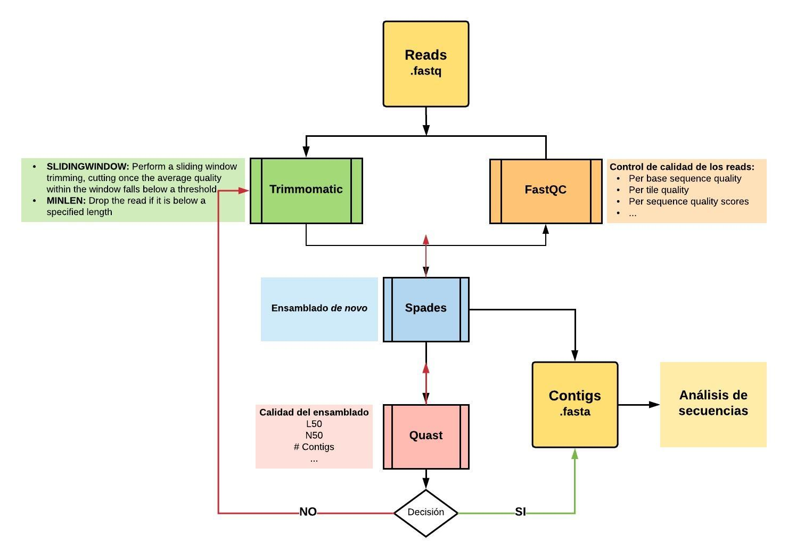
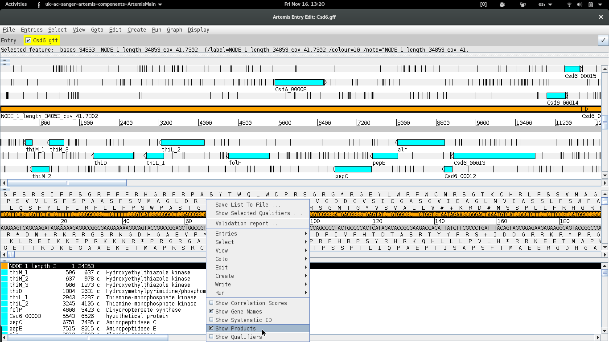

# Día 2: Control de calidad, ensamblado, y anotación de fósmidos de interés.

En este tutorial se muestran de forma breve los métodos computacionales básicos para el análisis de fósmidos seleccionados, secuenciados mediante la tecnología IonTorrent. Los pasos se aplican sobre un caso en particular, contenido en este repositorio, pero debería ser posible aplicarlos sobre otros fósmidos, lo cual se alienta de modo de permitir la comparación de resultados entre los estudiantes. Consultar a los docentes por otros sets de datos.



***Nota:** Los programas que se usan en este tutorial (excepto aquellos comandos que vimos en el práctico pasado) NO vienen, en general, instalados en Linux. Fueron instalados previamente por los docentes. Instalar programas en Linux no es tan trivial como en Windows, y requiere cierto entendimiento del funcionamiento del sistema operativo, y bastante paciencia.*

## 0 - Extracción y descompresión de archivos fastq
Abra una terminal y ubíquese en el directorio de trabajo "IonTorrentReads", dentro del directorio correspondiente al día 2. Si descargó los archivos en el _home_, entonces:
```
cd Curso_Metagenomica_IIBCE/Dia_2/IonTorrentReads/
ls
```
Como podrá observar, existe un archivo "Csd6.fastq.tar.gz". La extensión "tar.gz" indica que se trata de un tipo de archivo comprimido (similar a "zip"). Para descomprimirlo:
```
tar -xzf Csd6.fastq.tar.gz
ls -lh
```
`tar` es el programa de compresión/descompresión. El flag `x` significa "extraer", `z` significa que utiliza el algoritmo de compresión "gzip", y `f` significa que lo que sigue es el archivo sobre el cual el programa debe actuar. Para el caso del comando `ls` utilicé los _flags_ `l` para mostrar el formato **l**argo, y `h` para que muestre los tamaños de los archivos en un formato legible para el **h**umano (Mb en lugar de bytes, en este caso). 

Ahora, además del archivo comprimido, aparece "Cds6.fastq", el cual puede verse que tiene mayor tamaño según el paso anterior. 

**Ejercicio:**
 - ¿Cómo se puede ver qué contiene? Recuerde los comandos `head`, `less`, y `cat` de la clase anterior.

El formato "[fastq](https://en.wikipedia.org/wiki/FASTQ_format)" es similar al formato "fasta". Contiene en la primera línea un _header_ que siempre comienza con el símbolo "@", y luego información de la secuenciación que depende de cada tecnología. En una segunda línea se encuentra la lectura de los nucleótidos. En la tercera línea un símbolo de "+" que no cumple otra función más que de separador. Y en la cuarta fila contiene una secuencia de símbolos cuyo largo es el mismo que el largo de la línea 2, en la que cada símbolo respresenta un valor de calidad para cada nucleótido. Cada _read_ está representado por estas 4 líneas.

Si quisiéramos saber cuántos _reads_ contiene el fastq, no nos sirve contar los ">" utilizando `grep -c ">"`, como haríamos con un archivo fasta en el cual ese símbolo sólo aparecía una vez en el _header_. En los fastq, los _headers_ comienzan con "@", pero este símbolo también puede aparecer en la cuarta línea como un valor de calidad. Es necesario identificar una cadena de caracteres que aparezca una sola vez en cada _read_ y contar sus ocurrencias. En el caso del ejemplo, los _headers_ siempre comienzan con "@BOQ44:" (lo cual surge de la observación, aunque es esperable que estos archivos tengan algún identificador estándar). 

**Ejercicio:**
 - ¿Cómo haría para contar el número de _reads_ en el caso en el que está trabajando?


## 1 -  Control de calidad de los reads

Para analizar la calidad de la secuenciación vamos a utilizar [FastQC](https://www.bioinformatics.babraham.ac.uk/projects/fastqc/), el cual devuelve una serie de estadísticas sobre el archivo fastq.

```
fastqc Csd6.fastq
ls -ltr
```

FastQC devuelve un reporte con extensión "html" que puede abrirse con cualquier navegador.
```
firefox Csd6_fastqc.html
```
En este reporte aparecen una serie de estadísticas en cuanto a calidad, largo, secuencias repetidas, etc. En el primer gráfico puede observarse algo como esto:


En general se observa que los _reads_ tienen buena calidad, pero hacia el final de los mismos esta cae. Este perfil es típico de las tecnologías NGS, y se da porque como se trata de secuenciación por síntesis, las polimerasas comienzan a fallar, desfasarse y soltarse de la hebra de ADN, por lo que las lecturas comienzan a ser cada vez más ambiguas.

**Ejercicio:**
 - Discuta con sus compañeros el resto de los gráficos. Consulten a los docentes ante cualquier duda.

## 2 - Trimming

Como vimos, hacia el extremo 3' de los _reads_ la calidad comienza a disminuir y esto puede llevar a errores cuando se ensamblen, más adelante. Es necesario entonces recortar (_to trim_) los extremos de mala calidad. Para esto vamos a utilizar [trimmomatic](http://www.usadellab.org/cms/?page=trimmomatic). 

Una calidad de 15 se considera medianamente aceptable, por lo que vamos a utilizar la opción SLIDINGWINDOW con un tamaño de ventana de 5, y una calidad promedio de al menos 15. Por otro lado vamos a descartar todos aquellos reads cuyo largo, luego del proceso anterior, no supere los 50 pb. Al archivo de salida le vamos a llamar "Cds6_trim.fastq", para diferenciarlo del original.

```
trimmomatic SE -phred33 Csd6.fastq Csd6_trim.fastq SLIDINGWINDOW:5:15 MINLEN:50
ls -lhtr
```

**Ejercicio:**
 - ¿Qué significa cada parámetro?
 - ¿Qué información devuelve trimmomatic?
 - Analice la calidad del nuevo fastq utilizando FastQC (Esto debe hacerse siempre luego del _trimming_). Compare ambos histogramas.


Considerando que hay que buscar un equilibrio entre mantener una buena cantidad de datos, pero que estos sean de calidad, los parámetros pueden ajustarse. Un buen análisis implica probar varias veces, con distintos parámetros, y seleccionar el resultado que nos parezca mejor. Nunca quedarse con un sólo resultado, ni con los parámetros que vienen seteados por _default_ en los programas. Intente correr trimmomatic con otros parámetros (el manual se encuentra en el link del programa, más arriba), y compare resultados. El tutorial sigue con el archivo de salida del ejemplo.


## 3 - Ensamblado

Una vez que tenemos los reads filtrados según su largo y calidad, procederemos al ensamblaje de los mismos, utilizando un programa de ensamblaje de _novo_. Esto es, recrear la secuencia original uniendo los reads con regiones solapantes para formar Contigs (secuencias de mayor tamaño que se conocen en su totalidad).
El programa que utilizaremos aquí es [SPAdes](http://cab.spbu.ru/software/spades/). Para conocer los parámetros y opciones que admite se puede recurrir al manual del programa, o simplemente llamar al programa sin especificar ningún argumento.

```
spades.py
```

SPAdes admite un gran número de parámetros y opciones. Nosotros vamos a utilizar algunas de ellas simplemente para simplificar, pero está bueno que lean bien los manuales de los programas (y en lo posible las publicaciones) antes de utilizarlos. En particular, nuestros reads son de IonTorrent por lo que son _single end_. Además vamos a largar los procesos utilizando 2 procesadores para hacer más rápido los ensamblados.

```
spades.py --iontorrent -s Csd6_trim.fastq --threads 2 -o spades_assembly
ls -ltr
```

Como resultado obvtuvimos un directorio ("spades_assembly") el cual contiene el ensamblado. En este tutorial nos vamos a centrar solamente en el archivo "contigs.fasta".

**Ejercicio:**
 - ¿Cuántos contigs (secuencias) tiene nuestro ensamblado?

## 4 - Control de calidad del ensamblado

Una vez ensamblado debemos chequear la calidad del mismo. Utilizaremos [Quast](http://quast.bioinf.spbau.ru/) para dicho propósito. Llame al programa sin argumentos para ver las opciones básicas que admite (para ver todas las opciones, agregue el _flag_ `--help` al llamado).
```
quast.py
```

Básicamente necesitamos el archivo de entrada, y un nombre para el directorio de salida:
```
quast.py -o quast_qc spades_assembly/contigs.fasta 
ls -l quast_qc/
```

Dentro del directorio de salida vamos a encontrar varios archivos que contienen escencialmente la misma información en distintos formatos. Como ejemplo, para visualizar los resultados del pdf:

```
evince quast_qc/report.pdf
```
O para verlos en el navegador:

```
firefox quast_qc/icarus.html
```

**Ejercicio:**
Dos estadísticos muy utilizados para describir la calidad de un ensamblado son el N50 y el L50, los cuales aparecen en el reporte de Quast. 
 - Investigue qué información dan estos estadísticos.
 - Discuta el resultado con otros estudiantes que hayan utilizado un set de datos distinto, o que haya utilizado otros parámetros de _trimming_.


## 5 - Anotación funcional

Existen varias opciones para realizar la anotación funcional, pero todas requieren básicamente los siguientes pasos:
 - Predicción génica: implica, utilizando modelos estadísticos, identificar las regiones del ensamblado que corresponden a genes, ya sean CDS, genes ribosomales, genes de tRNA, etc.
 - Determinar su función comparando los genes predichos contra bases de datos curadas.
En nuestro caso vamos a utilizar [Prokka](https://github.com/tseemann/prokka), el cual se encuentra instalado de forma local, y funciona en línea de comandos al igual que el resto de los programas usados. Existen también servidores web que permiten subir los contigs y visualizar o descargar la anotación. El problema de estos últimos es que dependemos del tráfico que tenga el servidor por lo que puede llegar a demorar si la demanda es alta. Un ejemplo de servidor web de anotación muy utilizado es [RAST](http://rast.nmpdr.org/), el cual requiere previamente hacerse un usuario. Igual es más divertido usar la línea de comandos.

***Nota:** ambos programas están diseñados para trabajar con genomas procariotas. Para el caso de trabajar con organismos eucariotas, tanto el paso de anotación como los pasos previos pueden variar significativamente.*

Llame al programa `prokka` para ver la ayuda:

```
prokka --help
```

Vamos a utilizar opciones muy básicas ya que no tenemos información previa de lo que esperamos obtener.

```
prokka --outdir prokka_annot --prefix Csd6 --locustag Csd6 --cpus 2 spades_assembly/contigs.fasta 
ls -lrt prokka_annot/
```
Dentro del directorio de salida existen varios archivos con distinta extensión. El "txt" nos da una idea general del resultado de anotación.

**Ejercicio:**
 - ¿Cuántas secuencias codificantes (CDS) logró anotar?
 - Consulte en la web de Prokka qué son el resto de los archivos.
 - ¿Qué funciones aparecen en el fósmido?
 - Dada la actividad enzimática observada, ¿es posible identificar la/s enzima/s responsable/s de dicha actividad?

## 6 - Bonus track: Visualización

Para visualizar genomas (en nuestro caso el fósmido de interés) asociados a su anotación vamos a utilizar el _genome browser_ [Artemis](http://sanger-pathogens.github.io/Artemis/Artemis/). El ejecutable se encuentra en el directorio "\~/Descargas/artemis/" (o "\~/Downloads/artemis/"), y vamos a llamarlo de la siguiente forma:

```
~/Descargas/artemis/art prokka_annot/Csd6.gff
```

Probablemente apareza una ventana alertando sobre una _warning_, seguir adelante.
Una vez que se abre el Artemis, se van a visualizar tres paneles horizontales. El de más arriba muestra los 6 marcos de lectura posibles (los 3 de arriba hacia la derecha, y los 3 de abajo hacia la izquierda), con los genes identificados por prokka en turquesa, y barras negras indicando codones _stop_. El panel del medio es un poco lo mismo, pero a un nivel de _zoom_ más cercano y con mayor nivel de detalle. El último panel muestra información de cada gen. Para mejorar esta visualización hagan click derecho sobre este último panel, y marquen las opciones "_Show gene names_" y "_Show products_", como se muestra en la siguiente imagen:



**Ejercicio:**
 - Analizar y discutir los resultados.


