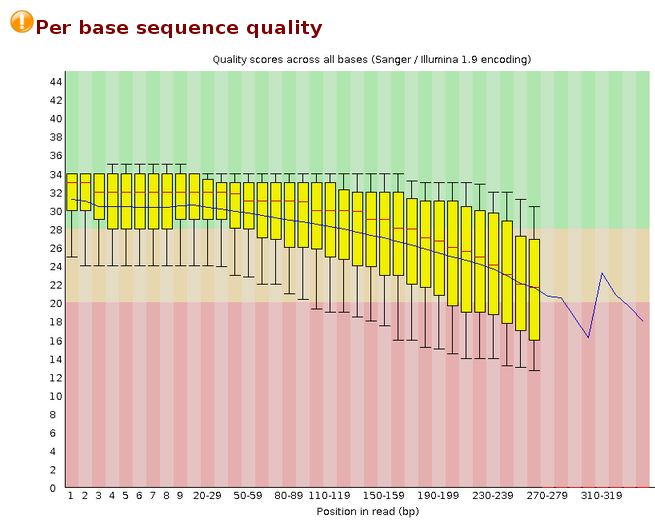

# Día 2: Control de calidad, ensamblado, y anotación de fósmidos de interés.

En este tutorial se muestran de forma breve los métodos computacionales básicos para el análisis de fósmidos secuenciados mediante la tecnología IonTorrent. Los pasos se aplican sobre un caso en particular, contenido en este repositorio, pero debería ser posible aplicarlos sobre otros fósmidos, lo cual se alienta de modo de permitir la comparación de resultados entre los estudiantes. Consultar a los docentes por otros sets de datos.

## 0 - Extracción y descompresión de archivos fastq
Abra una terminal y ubíquese en el directorio de trabajo "IonTorrentReads", dentro del directorio correspondiente al día 2. Si descargó los archivos en el _home_, entonces:
```
cd Curso_Metagenomica_IIBCE/Dia_2/IonTorrentReads/
ls
```
Como podrá observar, existe un archivo "Csd6.fastq.tar.gz". La extensión "tar.gz" indica que se trata de un tipo de archivo comprimido (similar a "zip"). Para descomprimirlo:
```
tar -xzf Csd6.fastq.tar.gz
ls -lh
```
`tar` es el programa de compresión/descompresión. El flag `x` significa "extraer", `z` significa que utiliza el algoritmo de compresión "gzip", y `f` significa que lo que sigue es el archivo sobre el cual el programa debe actuar. Para el caso del comando `ls` utilicé los _flags_ `l` para listar, y `h` para que muestre los tamaños de los archivos en un formato legible para el **h**umano (Mb en lugar de bytes, en este caso). 

Ahora, además del archivo comprimido, aparece "Cds6.fastq", el cual puede verse que tiene mayor tamaño según el paso anterior. 

**Ejercicio:**
 - ¿Cómo se puede ver qué contiene? Recuerde los comandos `head`, `less`, y `cat` de la clase anterior.

El formato "[fastq](https://en.wikipedia.org/wiki/FASTQ_format)" es similar al formato "fasta". Contiene en la primera línea un _header_ que siempre comienza con el símbolo "@", y luego información de la secuenciación que depende de cada tecnología. En una segunda línea se encuentra la lectura de los nucleótidos. En la tercera línea un símbolo de "+" que no cumple otra función más que de separador. Y en la cuarta fila contiene una secuencia de símbolos cuyo largo es el mismo que el largo de la línea 2, en la que cada símbolo respresenta un valor de calidad para cada nucleótido. Cada _read_ está representado por estas 4 líneas.

Si quisiéramos saber cuántos _reads_ contiene el fastq, no nos sirve contar los ">" utilizando `grep -c ">"`, como haríamos con un archivo fasta en el cual ese símbolo sólo aparecía una vez en el _header_. En los fastq, los _headers_ comienzan con "@", pero este símbolo también puede aparecer en la cuarta línea como un valor de calidad. Es necesario identificar una cadena de caracteres que aparezca una sola vez en cada _read_ y contar sus ocurrencias. En el caso del ejemplo, los _headers_ siempre comienzan con "@BOQ44:" (lo cual surge de la observación, aunque es esperable que estos archivos tengan algún identificador estándar). 

**Ejercicio:**
 - ¿Cómo haría para contar el número de _reads_ en el caso en el que está trabajando?


## 1 -  Control de calidad de los reads

Para analizar la calidad de la secuenciación vamos a utilizar [FastQC](https://www.bioinformatics.babraham.ac.uk/projects/fastqc/), el cual devuelve una serie de estadísticas sobre el archivo fastq.

```
fastqc Csd6.fastq
ls -ltr
```

FastQC devuelve un reporte con extensión "html" que puede abrirse con cualquier navegador.
```
firefox Csd6_fastqc.html
```
En este reporte aparecen una serie de estadísticas en cuanto a calidad, largo, secuencias repetidas, etc. En el primer gráfico puede observarse algo como esto:


En general se observa que los _reads_ tienen buena calidad, pero hacia el final de los mismos esta cae. Este perfil es típico de las tecnologías NGS, y se da porque como se trata de secuenciación por síntesis, las polimerasas comienzan a fallar, desfasarse y soltarse de la hebra de ADN, por lo que la calida de las lecturas comienza a ser cada vez más ambigua.

**Ejercicio:**
 - Discuta con sus compañeros el resto de los gráficos. Consulten a los docentes ante cualquier duda.

## 2 - Trimming

Como vimos, hacia el extremo 3' de los _reads_ la calidad comienza a disminuir y esto puede llevar a errores cuando se ensamblen, más adelante. Es necesario entonces recortar (_to trim_) los extremos de mala calidad. Para esto vamos a utilizar [trimmomatic](http://www.usadellab.org/cms/?page=trimmomatic). 

Una calidad de 15 se considera  relativamente aceptable, por lo que vamos a utilizar la opción SLIDINGWINDOW con un tamaño de ventana de 5, y una calidad promedio de al menos 15. Por otro lado vamos a descartar todos aquellos _reads_ cuyo largo, luego del proceso anterior, no supere los 50 pb. Al archivo de salida le vamos a llamar "Cds6_trim.fastq", para diferenciarlo del original.

```
trimmomatic SE -phred33 Csd6.fastq Csd6_trim.fastq SLIDINGWINDOW:5:15 MINLEN:50
ls -lhtr
```

**Ejercicio:**
 - ¿Qué significa cada parámetro?
 - ¿Qué información devuelve trimmomatic?
 - Analice la calidad del nuevo fastq utilizando FastQC (Esto debe hacerse siempre luego del _trimming_). Compare ambos histogramas.


Considerando que hay que buscar un equilibrio entre mantener una buena cantidad de datos, pero que estos sean de calidad, los parámetros pueden ajustarse. Un buen análisis implica probar varias veces, con distintos parámetros, y seleccionar el resultado que nos parezca mejor. Nunca quedarse con un sólo resultado, ni con los parámetros que vienen seteados por _default_ en los programas. Intente correr trimmomatic con otros parámetros (el manual se encuentra en el link del programa, más arriba), y compare resultados. El tutorial sigue con el archivo de salida del ejemplo.


## 3 - Ensamblado

Para ensamblar vamos a usar [SPAdes](http://cab.spbu.ru/software/spades/), un ensamblador _de novo_. Para ver qué opciones admite, o bien diríjase al manual en el link, o llame al programa sin usar ningún argumento:
```
spades.py
```

SPAdes admite un gran número de parámetros y opciones. Nosotros vamos a utilizar algunas de ellas simplemente para simplificar, pero está bueno que lean bien los manuales de los programas (y en lo posible las publicaciones) antes de utilizarlos. En particular, nuestros reads son de IonTorrent por lo que son _single end_. Además vamos a largar los procesos utilizando 2 procesadores para hacer más rápido los ensamblados.

```
spades.py --iontorrent -s Csd6_trim.fastq --threads 2 -o spades_assembly
ls -ltr
```

Como resultado obvtuvimos un directorio ("spades_assembly") el cual contiene el ensamblado. En este tutorial nos vamos a centrar solamente en el archivo "contigs.fasta".

**Ejercicio:**
 - ¿Cuántos contigs (secuencias) tiene nuestro ensamblado?

## 4 - Control de calidad del ensamblado

Una vez ensamblado debemos chequear la calidad del mismo. Utilizaremos [Quast](http://quast.bioinf.spbau.ru/) para dicho propósito. Llame al programa sin argumentos para ver las opciones básicas que admite (para ver todas las opciones, agregue el _flag_ `--help` al llamado).
```
quast.py
```

Básicamente necesitamos el archivo de entrada, y un nombre para el directorio de salida:
```
quast.py -o quast_qc spades_assembly/contigs.fasta 
```


